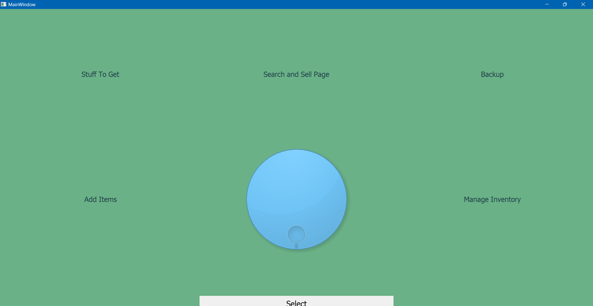
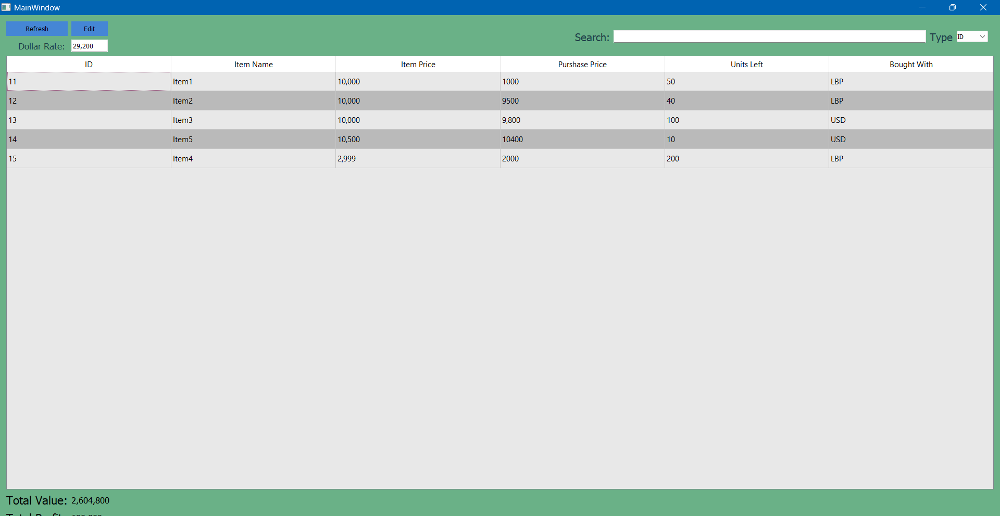
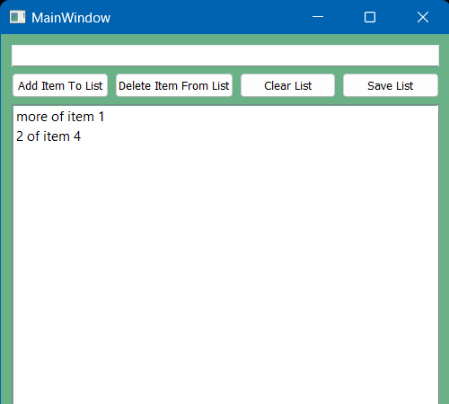

# Shop Management App

This Python application is designed for shop management, featuring functionalities to save data in SQLLITE, perform sales and inventory operations, and manage stock effectively.

## Features

- Save and manage data using an SQLLITE database.
- Perform sales and add operations.
- Simple Tools for managing stock levels and inventory.

## Try It Out

You can try the app [here](https://hk-studio.itch.io/shop-app).

## Contribution

Contributions are welcome! If you have suggestions or improvements, feel free to open an issue or submit a pull request.
